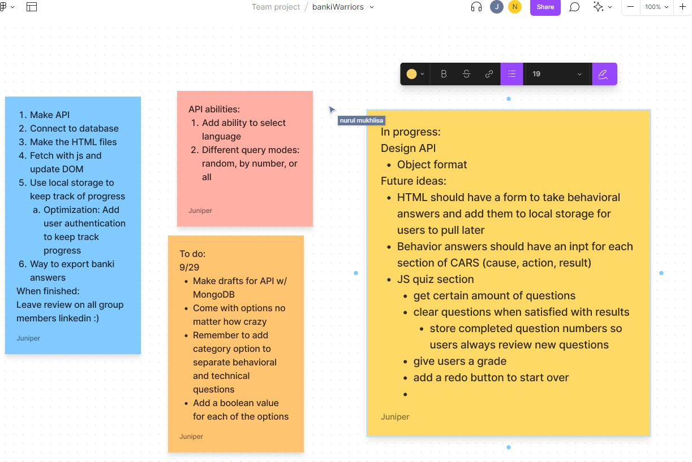

# Banki_Warriors

🛠️ Work in Progress Please Standby 🛠️

## Tech used:    

## Learning:
Focused on managing scope, we realize that while there are a lot of features we would like to add
 we need to make sure we manage our time properly in order to finish the main project within a reasonable amount of time.

## Things to pay attention to
Remember to review and update media queries, making sure everyone can see your content,
if not the app will only render correctly when users have a screen size similar to the test enviroment.

## Contributors:
<table bordercolor="#66b2b2">

  <tr>
    <td width="33.33%" valign="top">
		
<a target="_blank" href="https://github.com/Pressedj" align="center">Juniper</a>

         
      
    </td>
    <td width="33.3%" valign="top">
		
<a target="_blank" href="https://github.com/numulaa" align="center">Nurul</a>

       
        
    </td>
    <td width="33.33%" valign="top">
    
<a target="_blank" href="https://github.com/geekiedj" align="center">Barbara</a>

         
      
    </td>
  </tr>
</table>
